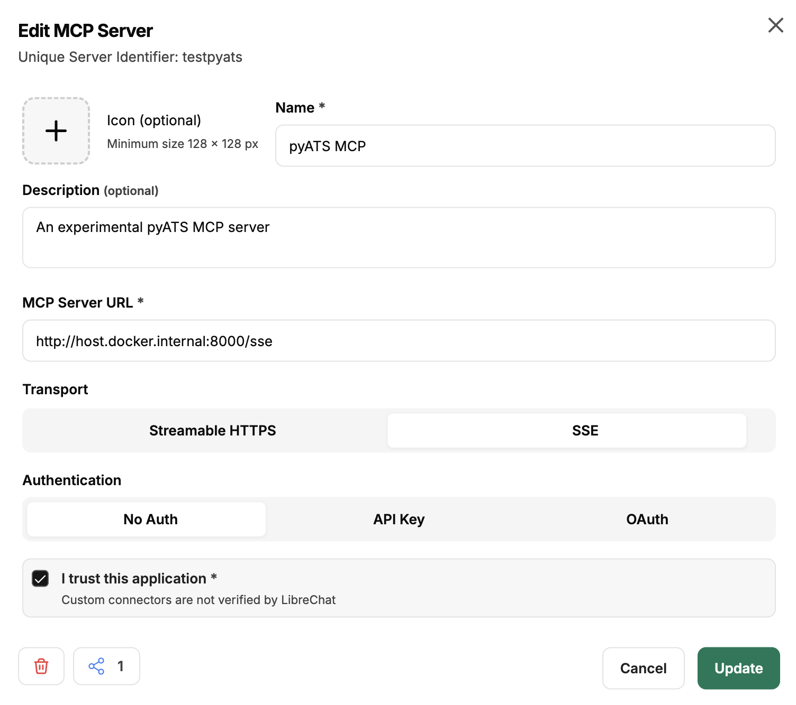
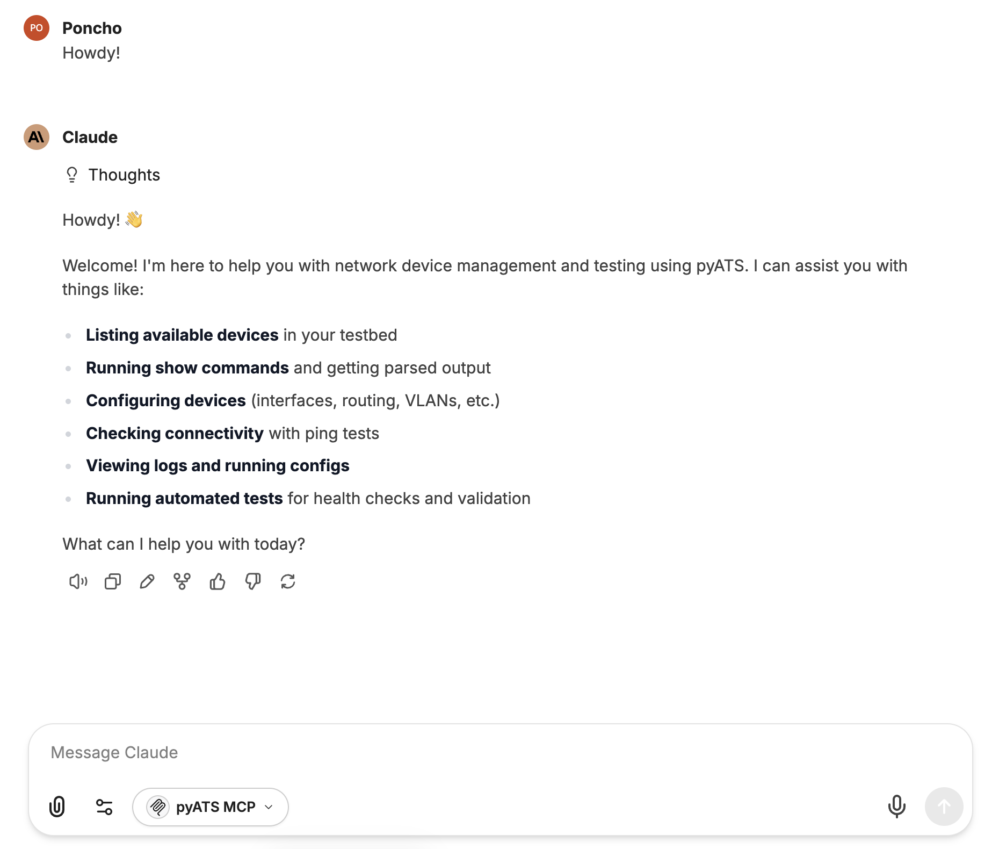
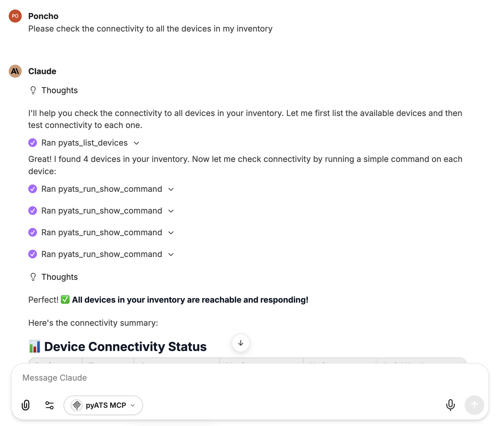
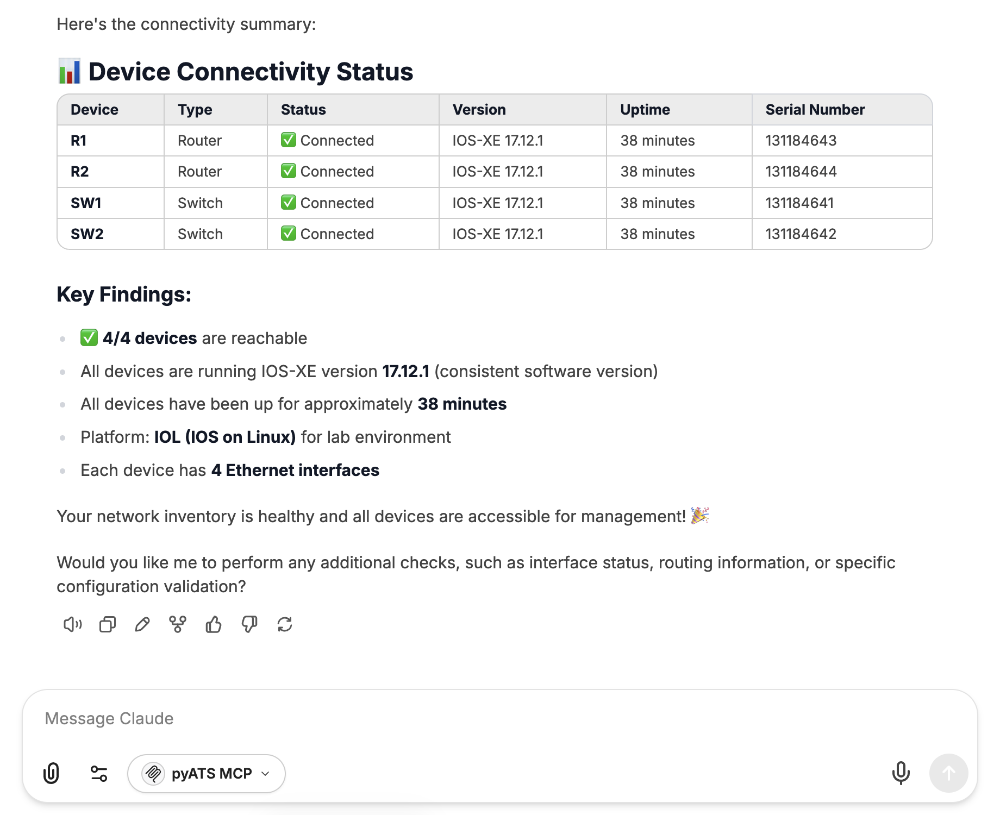
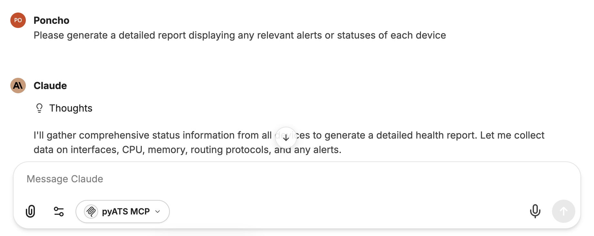
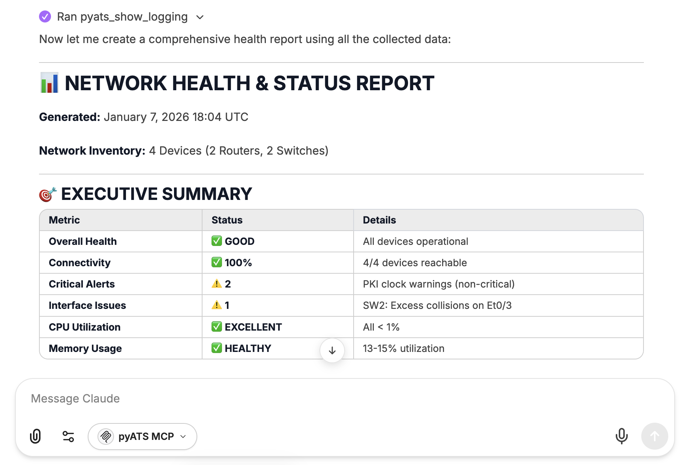
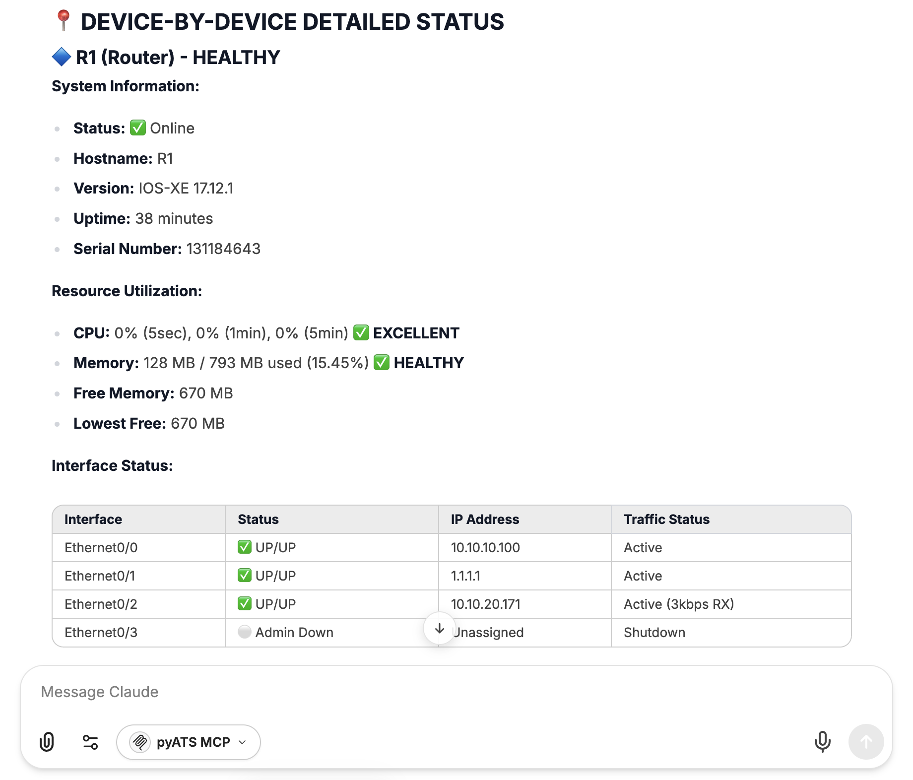
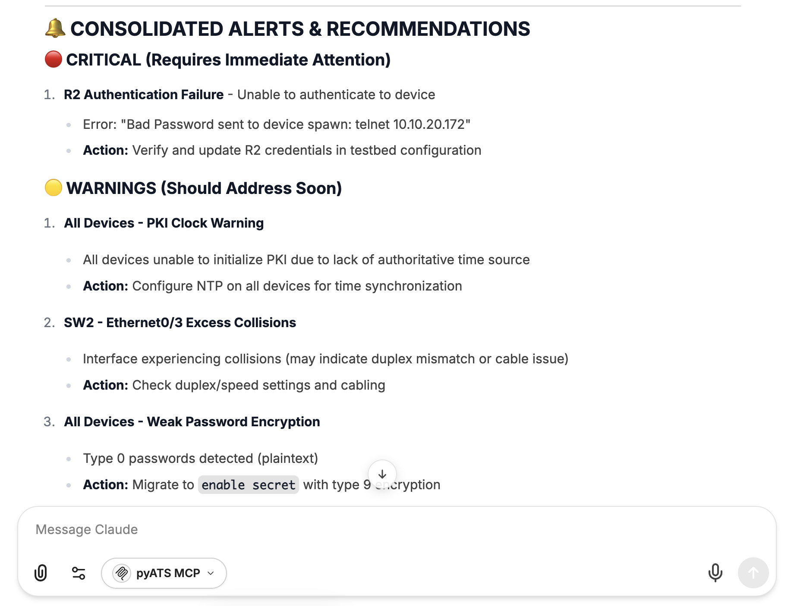
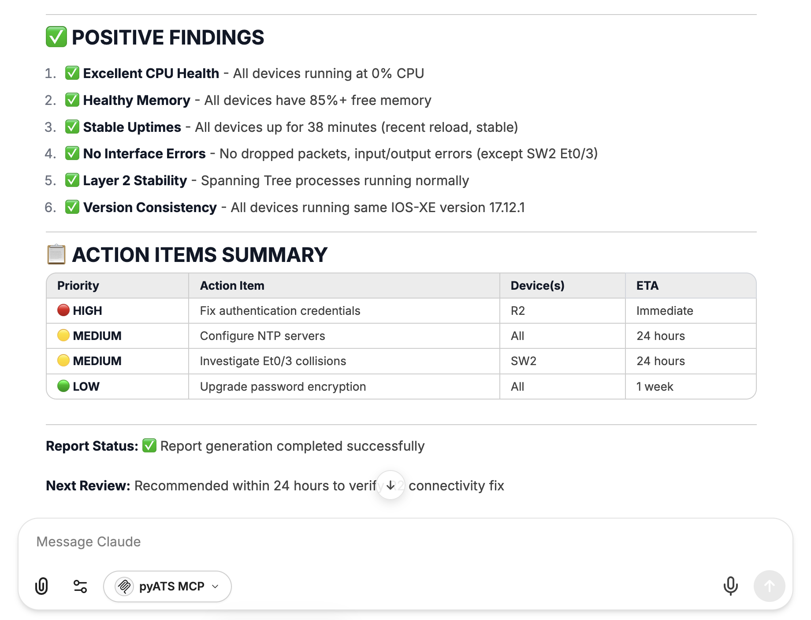

<h1 align="center"><strong>pyATS</strong> MCP server<br />

<div align="center">
  
  
  
  <a href="https://gofastmcp.com/getting-started/welcome"></a>
</div></h1>

<div align="center">
MCP server based on <a href="https://github.com/modelcontextprotocol/fastmcp"><strong>FastMCP</strong></a> that exposes key functionalities of the <a href="https://developer.cisco.com/docs/pyats/introduction/#cisco-pyats-network-test--automation-solution"><strong>Cisco pyATS</strong></a> network automation framework as MCP tools.
<br /><br />
</div>

> **⚠️ Disclaimer**: This MCP Server is not an official Cisco product. It was developed for learning and experimentation purposes.

## 🧰 Exposed MCP Tools

| Tool Name | Parameters | Description | Use Case |
|-----------|-----------|-------------|----------|
| 🗂️ **`pyats_list_devices`** | None | Lists all devices available in the testbed with their properties (os, type, platform, connections) | Discovery - Get an overview of all available network devices in your testbed |
| 📊 **`pyats_run_show_command`** | `device_name`: str<br>`command`: str | Executes a show command on a device and returns parsed output (or raw if parsing fails). Validates command safety (no pipes, redirects, or dangerous keywords) | General device interrogation - Run any show command and get structured data |
| ⚙️ **`pyats_configure_device`** | `device_name`: str<br>`config_commands`: str or list | Applies configuration to a device. Accepts multiline string or list of commands. Automatically handles config mode entry/exit. Preserves indentation for submode commands | Configuration changes - Apply interface configs, routing protocols, features, etc. |
| 📄 **`pyats_show_running_config`** | `device_name`: str | Retrieves the complete running configuration from a device (raw output) | Configuration backup or analysis - Get full device config |
| 📋 **`pyats_show_logging`** | `device_name`: str | Gets device logs using 'show logging' command (raw output) | Troubleshooting - Review device system logs and messages |
| 🏓 **`pyats_ping_from_network_device`** | `device_name`: str<br>`command`: str | Executes a ping command from a network device (e.g., 'ping 1.1.1.1' or 'ping 1.1.1.1 repeat 100'). Returns structured JSON with success rate and RTT if parsing succeeds | Connectivity testing - Verify reachability from the device's perspective |
| 🐧 **`pyats_run_linux_command`** | `device_name`: str<br>`command`: str | Executes a Linux command on a device (for Linux-based network devices) | Advanced operations - Run shell commands on devices with Linux CLI |
| 🧪 **`pyats_run_dynamic_test`** | `test_script_content`: str | Executes a standalone pyATS AEtest script for programmatic validation. Script must NOT connect to devices (all data must be embedded). Returns full job report with PASS/FAIL result | Automated validation - Run complex health checks, compliance tests, or multi-step validation workflows |

## 🧩 Requirements

- Python 3.10+
- [uv Python package manager](https://docs.astral.sh/uv/)

## 🛠️ Installation

Clone the repository in your deployment environment.
```bash
git clone https://github.com/ponchotitlan/pyATS_MCP
```
```bash
cd pyATS_MCP
```

## ⚙️ Setup

### `testbed.yaml` file
The pyATS framework is based on a testbed file which contains your device inventory. Open the `testbed.yaml` file and provide the connectivity details of your devices of interest following the convention of this file.

#### CML Always-On sandbox for testing

For testing purposes, a ready-made yaml file is provided to you. These devices are part of the CML (Cisco Modelling Lab) Always-On sandbox provided for free by Cisco DevNet. </br>

To make use of the devices given, you need to reserve and launch the **["Cisco Modelling Labs"](https://devnetsandbox.cisco.com/DevNet/catalog/cml-sandbox_cml) Always-On Sandbox**.</br>

Once reserved and launched, follow the instructions in the e-mail received to connect to a VPN and have access to all the devices mentioned in the `testbed.yaml` file.

> The environment where you deploy this MCP server must have that VPN access, otherwise the topology will be unreachable.

### `.env` file

Provide a `.env` file with the following information:

```
PYATS_TESTBED_PATH=location of your testbed.yaml file
MCP_TRANSPORT=stdio/http/sse
MCP_HOST=for http and sse. Default is 0.0.0.0 if not provided
MCP_PORT=for http and sse. Default is 8000 if not provided
```

## ⚡️ Running the MCP server

Run the following commands in your terminal:

```bash
uv sync
```

```bash
uv run pyats-mcp
```

You should see the following screen. The URL will change depending on the kind of transport that you setup in your `.env` file (stdio, http, sse):

```bash
2026-01-07 13:15:20,512 - PyatsFastMCPServer - INFO - 🤖 pyATS MCP Server starting!
2026-01-07 13:15:20,512 - PyatsFastMCPServer - INFO - ✅ Starting MCP server with sse transport on 0.0.0.0:8000


                                                       ╭──────────────────────────────────────────────────────────────────────────────╮                                                        
                                                       │                                                                              │                                                        
                                                       │                         ▄▀▀ ▄▀█ █▀▀ ▀█▀ █▀▄▀█ █▀▀ █▀█                        │                                                        
                                                       │                         █▀  █▀█ ▄▄█  █  █ ▀ █ █▄▄ █▀▀                        │                                                        
                                                       │                                                                              │                                                        
                                                       │                                FastMCP 2.13.1                                │                                                        
                                                       │                                                                              │                                                        
                                                       │                                                                              │                                                        
                                                       │               🖥  Server name: pyATS Network Automation Server                │                                                        
                                                       │                                                                              │                                                        
                                                       │               📦 Transport:   SSE                                            │                                                        
                                                       │               🔗 Server URL:  http://0.0.0.0:8000/sse                        │                                                        
                                                       │                                                                              │                                                        
                                                       │               📚 Docs:        https://gofastmcp.com                          │                                                        
                                                       │               🚀 Hosting:     https://fastmcp.cloud                          │                                                        
                                                       │                                                                              │                                                        
                                                       ╰──────────────────────────────────────────────────────────────────────────────╯                                                        


[01/07/26 13:15:20] INFO     Starting MCP server 'pyATS Network Automation Server' with transport 'sse' on http://0.0.0.0:8000/sse                                               server.py:2055
INFO:     Started server process [2968]
INFO:     Waiting for application startup.
INFO:     Application startup complete.
INFO:     Uvicorn running on http://0.0.0.0:8000 (Press CTRL+C to quit)
```

## ⚡️ Usage example: LibreChat app

LibreChat is an open-source app for all your AI conversations, fully customizable and compatible with any AI provider and MCP server, including ours.</br>
For this demo, we will use the [Docker version](https://www.librechat.ai/docs/local/docker) of this app for a local deployment.

> You need to have Docker installed in your host environment to run this deployment.

To get started, clone the repository in your environment and copy the default `.env` file provided:

```bash
git clone https://github.com/danny-avila/LibreChat.git
```

```bash
cd LibreChat
```

```bash
cp .env.example .env
```

Now, copy the files `librechat.yaml` and `docker-compose.override.yml` located in the folder `librechat_setup` of this repository into the root directory of the LibreChat repository. This will allow us to onboard our local MCP server once the LibreChat app is started.

Finally, spin all the containers using the following command:

```bash
docker compose up -d
```

Once ready, login to the LibreChat app in your browser using the URL `http://localhost:3080/`. After creating an account, on the main page navigate to the left side and click the **+** button next to the banner that reads *Filter MCP servers by name*.

Afterwards, execute your MCP server **in SSE transport mode** and fill all the information requested.

> Very important! The URL of your MCP server shall be `http://host.docker.internal:8000/sse`, provided that LibreChat is on a container environment.

<div align="center">

</div></br>

Once the connection is successful, the MCP server will be available for your chats and requests!

<div align="center">

</div></br>

To get started, you can check connectivity to all your devices in the testbed:

<div align="center">

</div></br>
<div align="center">

</div></br>

An example of a use case is to ask your LLM to generate a detailed report highlighting any alerts or warnings:

<div align="center">

</div></br>
<div align="center">

</div></br>
<div align="center">

</div></br>
<div align="center">

</div></br>
<div align="center">

</div></br>

---